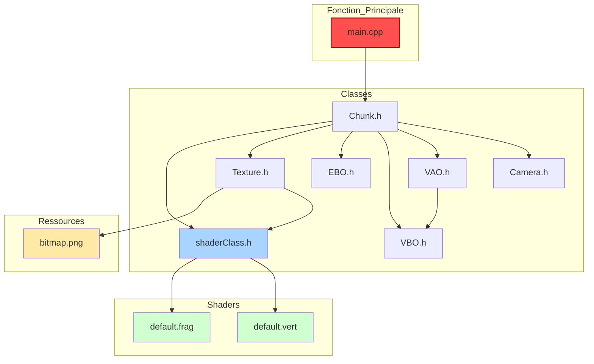

Graph représentant la structure de fichier du projet :

```mermaid
graph TD

%% =======================
%% STRUCTURE DES NŒUDS
%% =======================

%% Fichiers principaux
    MAIN[main.cpp]

%% Classes
    CHUNK[Chunk.h]
    CAM[Camera.h]
    VAO[VAO.h]
    VBO[VBO.h]
    EBO[EBO.h]
    TEX[Texture.h]
    SHD[shaderClass.h]

%% Shaders
    VERT[default.vert]
    FRAG[default.frag]

%% Ressources
    BMP[bitmap.png]

%% =======================
%% LIENS
%% =======================
    MAIN --> CHUNK

    CHUNK --> CAM
    CHUNK --> VAO
    CHUNK --> VBO
    CHUNK --> EBO
    CHUNK --> TEX
    CHUNK --> SHD

    VAO --> VBO

    TEX --> SHD
    TEX --> BMP

    SHD --> VERT
    SHD --> FRAG

%% =======================
%% SOUS-GRAPHES
%% =======================
subgraph Fonction_Principale
    MAIN
end

subgraph Classes
    CHUNK
    CAM
    VAO
    VBO
    EBO
    TEX
    SHD
end

subgraph Shaders
    VERT
    FRAG
end

subgraph Ressources
    BMP
end

%% =======================
%% STYLE
%% =======================
    style MAIN fill:#ff4f4f,stroke:#900,stroke-width:1.5px
    style SHD fill:#a9d4ff
    style VERT fill:#d0ffd0
    style FRAG fill:#d0ffd0
    style BMP fill:#ffe9a6

```
